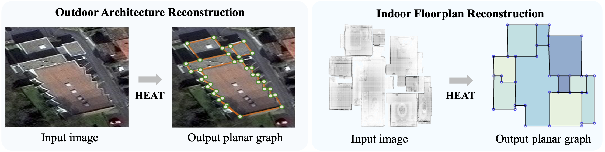
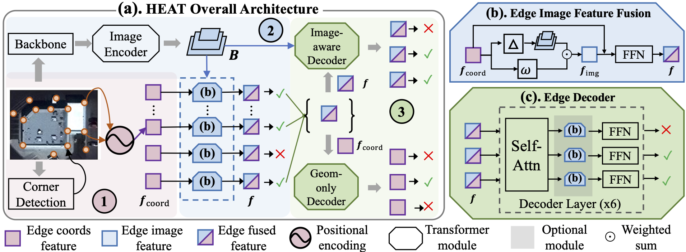
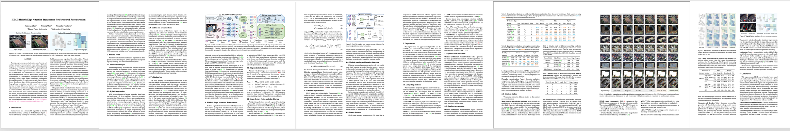

# Abstract

	 

>

This paper presents a novel attention-based neural network for structured reconstruction, which takes a 2D raster image as an input and reconstructs a planar graph depicting an underlying geometric structure. The approach detects corners and classifies edge candidates between corners in an end-to-end manner. Our contribution is a holistic edge classification architecture, which
1) initializes the feature of an edge candidate by a trigonometric positional encoding of its end-points; 2) fuses image feature to each edge candidate by deformable attention; 3) employs two weight-sharing Transformer decoders to learn holistic structural patterns over the graph edge candidates; and 4) is trained with a masked learning strategy. The corner detector is a variant of the edge classification architecture, adapted to operate on pixels as corner candidates. We conduct experiments on two structured reconstruction tasks: outdoor building architecture and indoor floorplan planar graph reconstruction. Extensive qualitative and quantitative evaluations demonstrate the superiority of our approach over the state of the art.

# Method Overview

	 

>

<strong>(a)</strong>. The overall architecture of HEAT, which consists of three steps: 1) edge node initialization; 2) edge image feature fusion and edge filtering; and 3) holistic structural reasoning with two weight-sharing Transformer decoders.  <strong>(b)</strong>. The image feature fusion module for edge nodes. <strong>(c)</strong>. The edge Transformer decoder. For the geometry-only (geom-only) decoder, \( {f} \) is replaced by \( {f}_{coord} \) and the image feature fusion module (gray part) is discarded.

# Paper

	

>

	<a href="assets/paper.pdf"> Download PDF </a> &nbsp; &nbsp; <a href="https://arxiv.org/abs/2111.15143"> Arxiv </a> &nbsp; &nbsp; <a href="assets/supp.pdf"> Supplementary </a> &nbsp; &nbsp; 
	<!-- <a href="assets/poster.pdf"> Poster </a> -->

 

	<strong>@InProceedings{</strong>chen2022heat,
	 
	&nbsp;&nbsp;&nbsp;&nbsp; title={HEAT: Holistic Edge Attention Transformer for Structured Reconstruction}, 
	  
	&nbsp;&nbsp;&nbsp;&nbsp; author={Jiacheng Chen, Yiming Qian, Yasutaka Furukawa},
	  
	&nbsp;&nbsp;&nbsp;&nbsp; booktitle={IEEE Conference on Computer Vision and Pattern Recognition (CVPR)},
	  
	&nbsp;&nbsp;&nbsp;&nbsp; year={2022} <strong>}</strong>

<!-- # Video -->

<!-- 

<iframe width="820" height="492" src="https://www.youtube.com/embed/nlp6EC4D68I" frameborder="0" allow="accelerometer; autoplay; clipboard-write; encrypted-media; gyroscope; picture-in-picture" allowfullscreen></iframe>

 -->

# Code / Pre-trained Models

Our code and pre-trained models are available on our [Github repo](https://github.com/woodfrog/heat).
